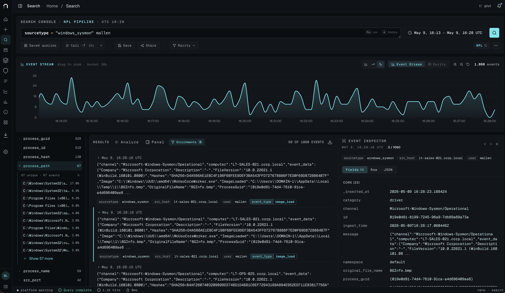
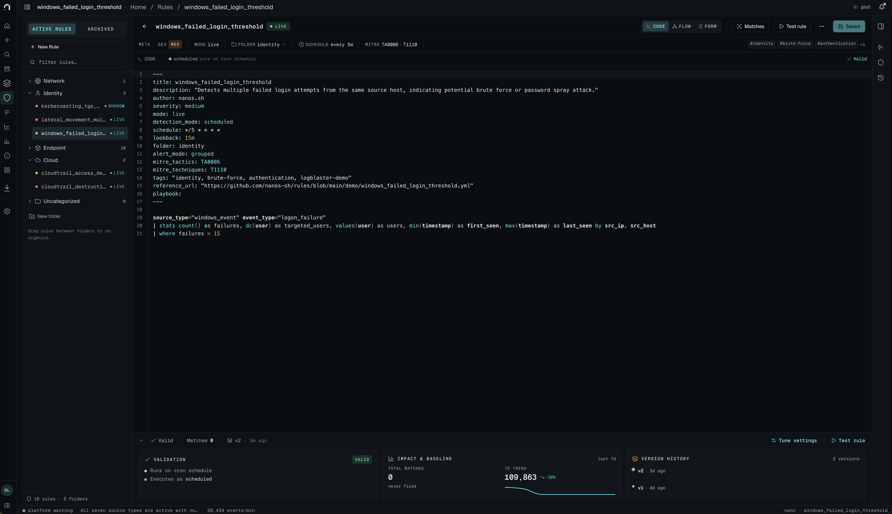
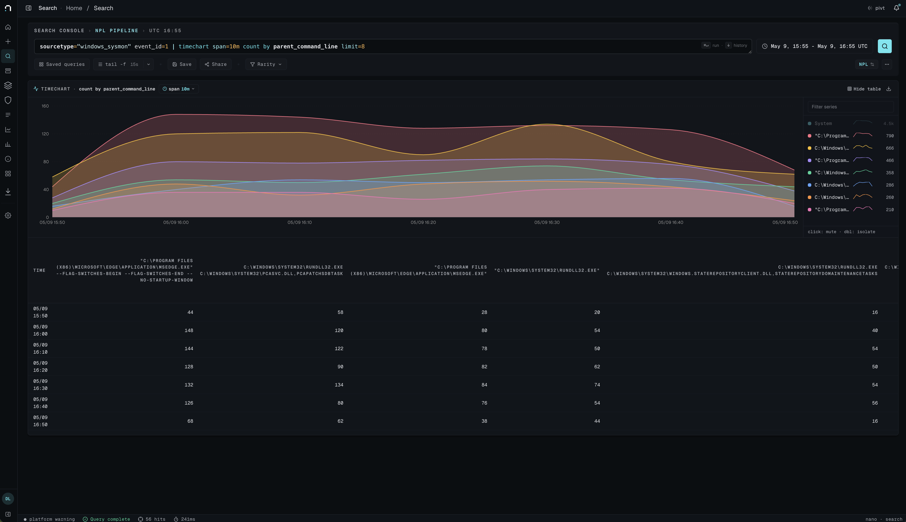
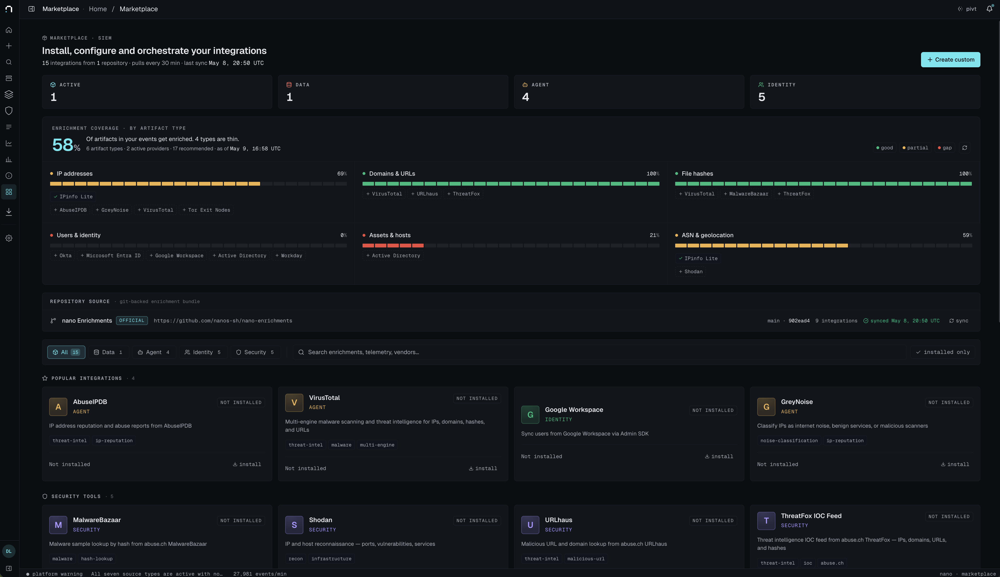

<p align="center">
  <picture>
    <source media="(prefers-color-scheme: dark)" srcset="./logo_white.svg">
    <source media="(prefers-color-scheme: light)" srcset="./logo_blue.svg">
    
  </picture>
</p>

<p align="center">
  A lightweight, opinionated SIEM. Search, detection, and triage for security
  analysts who want to ship signal — not babysit a data lake.
</p>

<p align="center">
  <a href="./LICENSE"></a>
  <a href="https://discord.gg/5rk8bwmkj7"></a>
</p>

<p align="center">
  <a href="https://nano.rs">Website</a>
  ·
  <a href="https://nano.rs/docs/getting-started/first-feed/">Docs</a>
  ·
  <a href="https://discord.gg/5rk8bwmkj7">Discord</a>
  ·
  <a href="https://nano.rs/pricing">Hosted</a>
</p>

<p align="center">
  
</p>

---

nano is built around a small set of beliefs:

- **The UDM is the contract.** Logs land in 75+ explicit columns; ad-hoc fields
  go in `ext`. Searches stay fast because the schema does the work.
- **nPL beats SQL for hunting.** A piped query language (`error | stats count
  by src_ip | where count > 10`) keeps analyst muscle memory portable.
- **Detections have a lifecycle.** Rules move Staging → Live → Alerting. Match
  counts and signals are visible at every step.
- **Restraint over decoration.** 1px borders, 11–13px text, mono for IDs and
  timestamps. The UI is the same density a terminal user expects.

This repository is the open-core engine, licensed under **AGPL-3.0**. Hosted
plans, the pivt AI assistant, Cases, incidents, and risk scoring are
available from [nano.rs](https://nano.rs).

## Install

One command on any host with Docker:

```sh
curl -fsSL https://raw.githubusercontent.com/nano-rs/nano/main/install.sh | bash
```

<p align="center">
  <video src="./docs/img/install-demo.mp4" controls muted preload="metadata" width="900"></video>
</p>

<p align="center">
  <em>One command. 45 seconds. Working nano instance.</em>
</p>

The installer clones this repo to `~/nano`, generates secrets, pulls the
prebuilt images from `ghcr.io/nano-rs`, brings up the stack
(postgres + clickhouse + api/search/jobs/web + vector + nginx), and walks
you through creating the first admin account. Open `http://localhost`
when it finishes.

**Prereqs:** Docker, docker compose v2, git, openssl, curl.

For non-interactive installs, pre-set `NANO_ADMIN_EMAIL`,
`NANO_ADMIN_NAME`, `NANO_ADMIN_PASSWORD`, and `NANO_BASE_URL` before
piping. See [`.env.opensource.example`](./.env.opensource.example) for
the full env-var surface.

## What's in the box

- **Ingestion** — Vector-based collectors with VRL parsers (HTTP push,
  syslog, S3 pull). Parser content is published separately under Apache-2.0.
- **Storage** — ClickHouse for events (daily partitions, 90-day default TTL),
  PostgreSQL for metadata.
- **Search** — nPL parser, ClickHouse SQL generator, field-stat sidebar,
  bloom-filter-aware tokenization.
- **Detection** — scheduled (cron) + real-time (materialized view) rules,
  signal logging, prevalence-based noise reduction.
- **Alerts** — lifecycle (new → triaged → resolved), grouping, dedup.
- **Marketplace** — install + configure out-of-the-box enrichment
  providers (threat intel, identity, asset inventory, geolocation).
  Coverage indicator across UDM fields.
- **Web UI** — React SPA, lazy-loaded, runs in any modern browser.

<p align="center">
  
</p>

<p align="center">
  <em>Detection rule editor — Staging → Live → Alerting lifecycle, MITRE ATT&amp;CK tagging, baseline impact, validation, and version history.</em>
</p>

<p align="center">
  
</p>

<p align="center">
  <em>Hunting in nPL — <code>sourcetype="windows_sysmon" event_id=1 | timechart span=10m count by parent_command_line limit=8</code>. Stacked per-series visualization, top-N split-by, results table inline.</em>
</p>

<p align="center">
  
</p>

<p align="center">
  <em>Marketplace — out-of-the-box enrichment catalog (threat intel, identity, asset inventory, geolocation). Coverage indicator tracks which UDM fields have a provider behind them.</em>
</p>

## Develop from source

The [Install](#install) flow above is the right path if you just want
to run nano. To hack on the engine itself:

- Prereqs: Rust stable, Node 20+, PostgreSQL 18+, ClickHouse 24+
- Bring up Postgres + ClickHouse via your usual local tooling
- `./scripts/start-microservices-dev.sh` — launches `nanosiem-api` (3000),
  `nanosiem-search` (3002), and `nanosiem-jobs` with sane local defaults
- `cd nanosiem-web && npm install && npm run dev` (port 5173)

See [CONTRIBUTING.md](./CONTRIBUTING.md) for the day-to-day dev workflow
and what env vars to override.

Full documentation: **[nano.rs/docs](https://nano.rs/docs/getting-started/first-feed/)**.

## Architecture

```
+------------+     +------------+     +-------------+
|  Vector    | --> | nanosiem-  | --> | ClickHouse  |
|  parsers   |     | api  :3000 |     | (events)    |
+------------+     +------------+     +-------------+
                         |                   ^
                         v                   |
                   +------------+     +------+------+
                   | PostgreSQL |     | nanosiem-   |
                   | (rules,    |     | search:3002 |
                   |  alerts,   |     +-------------+
                   |  audit)    |             ^
                   +------------+             |
                                       +-------------+
                                       | nanosiem-   |
                                       | web (SPA)   |
                                       +-------------+
```

- `nanosiem-api` — rules, alerts, settings, ingestion, OpenAPI at `/swagger-ui`
- `nanosiem-search` — query execution, field stats, log fetch
- `nanosiem-jobs` — scheduled detection runner, repository sync
- Both Postgres + ClickHouse required for full features. The DualPool
  abstraction lets services degrade to Postgres-only when ClickHouse is
  briefly unavailable.

## Documentation

- **[Getting Started](https://nano.rs/docs/getting-started/first-feed/)** —
  bring up nano and ingest your first feed
- **[Search Commands (nPL)](https://nano.rs/docs/search-commands/)** —
  pipe commands, eval functions, syntax reference
- **[Detection Authoring](https://nano.rs/docs/user-guide/detections/)** —
  write rules, manage lifecycle, tune for noise
- **[UDM Reference](https://nano.rs/docs/reference/udm-fields/)** — the
  75+ explicit columns the schema is built around
- **[Coding Agents](https://nano.rs/docs/coding-agents)** — manage
  searches, parsers, and detections via Claude Code / Codex pointed at
  your nano instance. The hosted plan ships an in-app AI assistant
  (pivt); coding-agents brings equivalent leverage to open-core
  deployments, locally.

## Ecosystem

The engine works on its own, but a small set of companion repos ships
the content layer most teams want on day one:

- **[nano-enrichments](https://github.com/nanos-sh/nano-enrichments)** —
  threat-intel feeds, identity providers, and asset-inventory adapters
  wired into the in-app marketplace
- **[parsers](https://github.com/nanos-sh/parsers)** — Vector + VRL
  parsers for common log sources (proxy, EDR, cloud audit, Windows)
- **[rules](https://github.com/nanos-sh/rules)** — curated detection
  rules, importable into nano via the rule library
- **[nanodac](https://github.com/nanos-sh/nanodac)** —
  detection-as-code: define rules in Git, sync to nano via GitOps
- **[models](https://github.com/nanos-sh/models)** — LiteLLM model
  catalog backing pivt's AI features

## What's open vs. hosted

This repository is the open-core engine — functionally complete for
ingestion, search, detection, and alerting. Some platform features ship
only in the hosted distribution at [nano.rs](https://nano.rs):

- **Cases** — investigation management, collaborative notebooks
- **Incidents** — multi-case orchestration, queue routing
- **pivt** — ambient AI assistant covering detection generation, rule
  tuning, query review, parser editing, and shadow investigation
- **Risk scoring** — entity-level risk across users, hosts, and cloud
  accounts
- **Auto-tuning** — AI-driven false-positive reduction

Self-hosting nano with these features requires a commercial license —
[hello@nano.rs](mailto:hello@nano.rs).

## Roadmap

- Public detection-rule library (community-contributed)
- OpenTelemetry log/trace ingestion
- Parser SDK for community-authored VRL parsers
- Saved-query API + CLI client
- See [open issues](https://github.com/nanos-sh/nano/issues) for the
  active backlog

## Community

- **Star this repo** if nano is useful to you — it helps others find it
- **[Discord](https://discord.gg/5rk8bwmkj7)** — questions, design
  discussions, show-and-tell
- **[Good first issues](https://github.com/nanos-sh/nano/issues?q=is%3Aissue+is%3Aopen+label%3A%22good+first+issue%22)** —
  curated entry points for new contributors
- **[Discussions](https://github.com/nanos-sh/nano/discussions)** —
  longer-form Q&A and proposals

## Contributing

We accept community contributions under a CLA — see
[CONTRIBUTING.md](./CONTRIBUTING.md) and
[.github/ICLA.md](./.github/ICLA.md). DCO is not sufficient because nano is
open-core; the CLA grants Nano LLC the sublicensing right needed to keep
parts of the platform proprietary while still accepting your patches.

Bug reports and feature requests:
[issue templates](./.github/ISSUE_TEMPLATE/).

## Security

Found a vulnerability? Please don't open a public issue. See
[SECURITY.md](./SECURITY.md) — short version: email
[security@nano.rs](mailto:security@nano.rs) with a 90-day disclosure window.

## License

The engine in this repository is licensed under the GNU Affero General
Public License v3.0 or later. See [LICENSE](./LICENSE).

If AGPL doesn't fit your deployment, a commercial license is available —
get in touch at [hello@nano.rs](mailto:hello@nano.rs).
